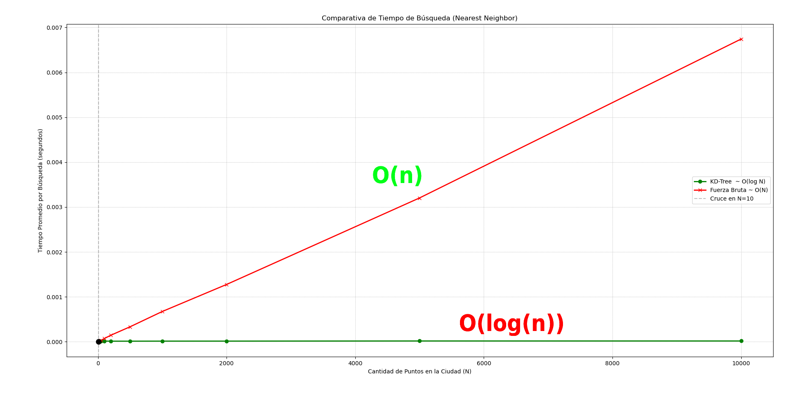

# KD-Tree
**Autor:** Jefferson Lizarazo Arias (Algunas partes del código fueron desarrolladas con ayuda de IA)

Este repositorio implementa una solución de estructuración de datos basada en **Árboles KD (KD-Tree)** para optimizar la logística de entregas en una gran ciudad. 

## Contexto del Problema

Dado un conjunto estático de 10,000 puntos de entrega (coordenadas X,Y), existen problemas funcionales al querer descubrir de manera concurrente cuáles son las entregas más cercanas respecto a una ubicación, o aquellos puntos atrapados dentro de un radio en específico. 
A través de un recorrido iterativo convencional ("Fuerza Bruta"), los tiempos decrecen drásticamente a medida que aumenta la densidad poblacional.

Este repositorio resuelve el problema codificando un árbol KD-Tree puro desde cero (soportando múltiples dimensiones). El KD-Tree ataca dos aspectos críticos:
1. **Range Search:** Extraer todos los puntos a un radio $r$ de un punto.
2. **Nearest Neighbor:** Detectar matemáticamente el punto de entrega de forma óptima.

## Criterio Usado Para La Mediana

Durante la construccion del KD-Tree, en cada nivel se ordenan los puntos segun el eje activo y se selecciona como pivote el elemento central del arreglo ordenado.

Esta decision se documenta de forma explicita porque, en terminos estadisticos, la mediana puede discutirse desde la distribucion de los datos. En este trabajo se utilizaron datos sinteticos homogeneos, generados de manera uniforme en el espacio de coordenadas, por lo que tomar el punto central de la muestra ordenada sobre cada eje resulta consistente con la mediana empirica empleada para balancear el arbol.

En otras palabras, para este ejercicio no se busco dividir el plano por areas bajo la curva equivalentes, sino repartir de manera aproximadamente equilibrada la cantidad de puntos a izquierda y derecha del corte.
## Estructura del Repositorio

- `KDtree.py`: Archivo core. Contiene clases `Node`, `KDTree` y la alternativa iterativa `FuerzaBruta` (en forma de lista). En el árbol se manejan los algoritmos de partición y las podas de búsquedas que omiten sub-planos incorrectos.
- `test.py`: Contiene los validadores lógicos iterativos usando `unittest` que aseguran total exactitud en los resultados del árbol comparado a la fuerza bruta. Adicionalmente inyecta una simulación en un mapa virtual 2D mediante **matplotlib**.
- `analisis.py`: Componente de métricas. Elabora benchmarks contra múltiples masas de datos ($N = 10 \to N = 20,000$) revelando un diagnóstico visual con el momento límite en que un algoritmo sobrepasa a su contraparte.

## Instalación y Requisitos

Se requiere el uso de `matplotlib` para que funcionen las comprobaciones visuales y las métricas en diagramas:

```bash
pip install matplotlib
```

## Ejecución

1. **Para testear exactitud y representaciones visuales:**
   ```bash
   python test.py
   ```
   *Nota: Las figuras son bloqueantes, para que aparezca la siguiente comprobación visual necesitas cerrar la ventana actual de matplotlib.*

2. **Para correr el analisis de velocidad:**
   ```bash
   python analisis.py
   ```

## Análisis y Resultados

### ¿Para qué tamaño de datos el Árbol KD comienza a ser más rápido que listas (fuerza bruta)?


Debido a que el KD-tree emplea recusividad y cálculo de distancias sobre hiperplanos, tiene cierta sobrecarga (overhead) en tiempos de ejecución inicial en comparación a un loop "for" limpio. 

No obstante, al correr `analisis.py` sobre los datos sintéticos de coordenadas, la gráfica revela el punto de cruce. Típicamente en la implementacion, **el Árbol-KD cruza y comienza a ser más rápido que una lista a partir la escala de los $N = 50$ - $N = 100$ puntos.**

Al entrar la problemática real donde se tienen **10,000 puntos en la ciudad**, el KD-Tree reduce el tiempo por una fracción asombrosamente superior gracias a su aproximación de complejidad temporal de búsqueda $\approx O(\log N)$. Un array de fuerza resiente el peso del cálculo de las raíces cuadradas, escalando de manera vertical $O(N)$.
